# Step1-git clone 

> git clone 

```bash
git clone 
```


# Step2-execute docker-compose

> execute docker-compose

i use docker-desktop in windows 

```bash
docker-compose up -d
```

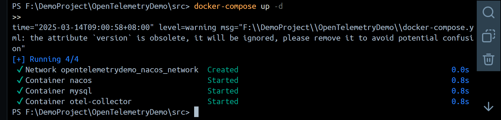

after that you can see container like this

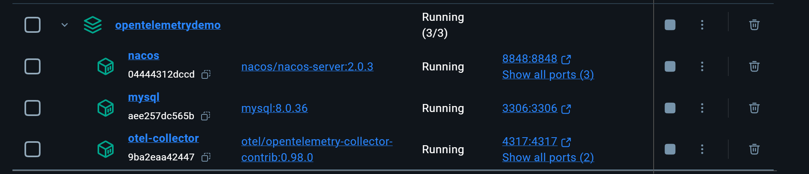


# Step3-execute sql

> init mysql

use nacos require create table in mysql. I provide sql script.

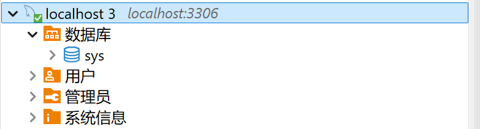

1、execute `alter_root_login_plugin.sql`

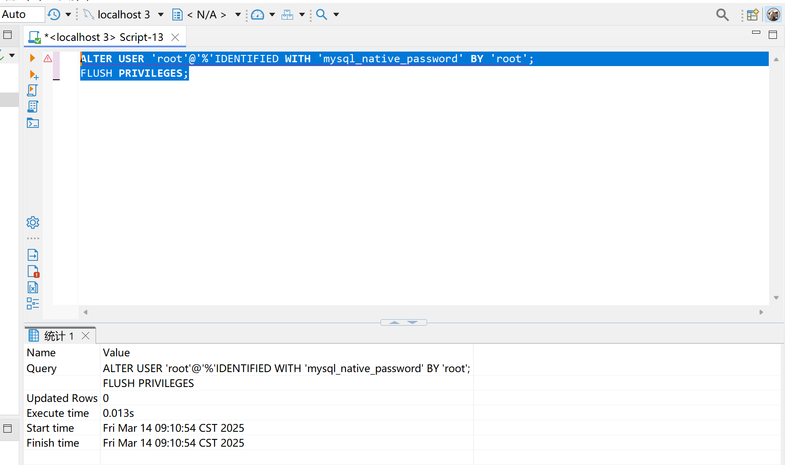

2、execute `nacos_init.sql`

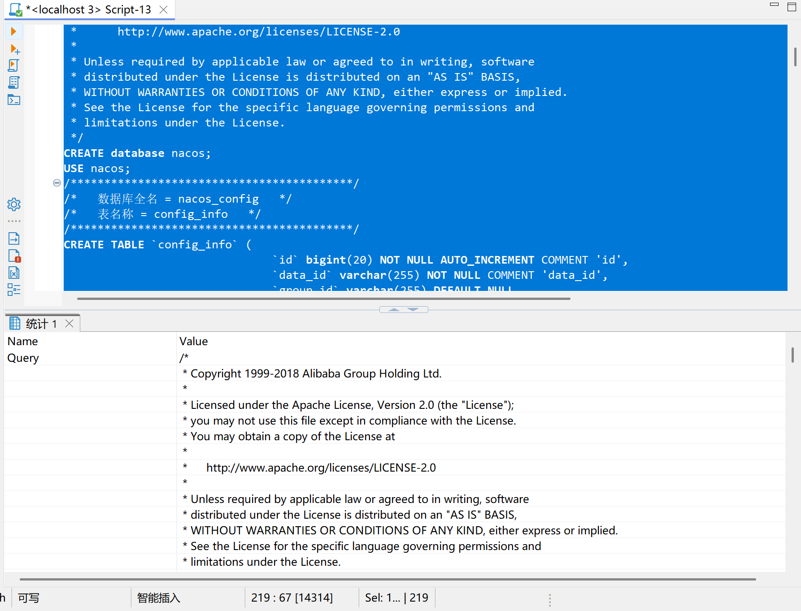

after execute sql table in mysql like this

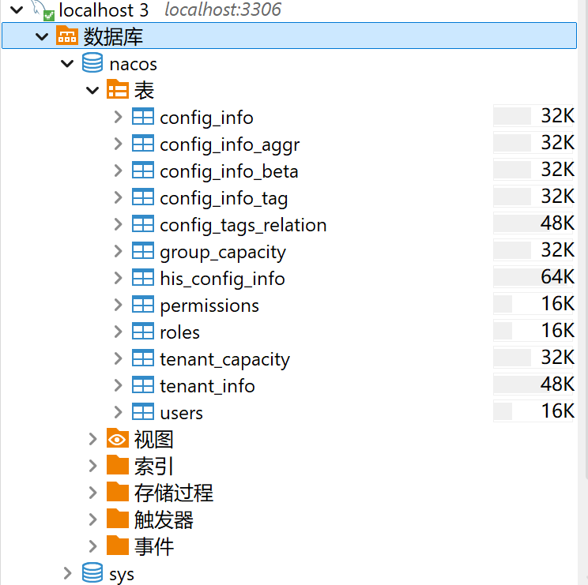

# Step4-restart Nacos

> `restart nacos`

you can access nacos UI through the following URL 

```http
http://localhost:8848/nacos/
```

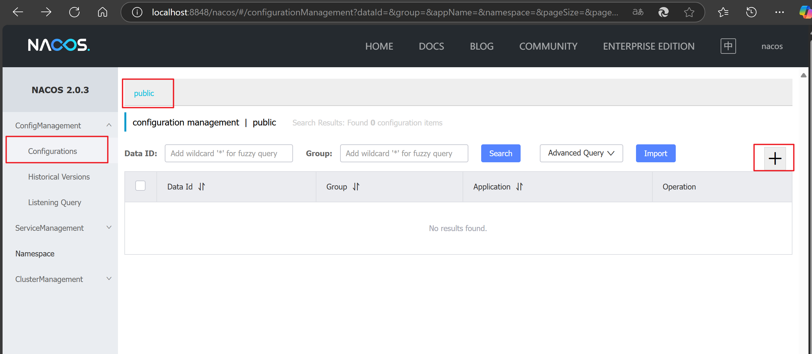

add following configuration in nacos

```yaml
spring:
  datasource:
    url: jdbc:mysql://localhost:3306/naos?autoReconnect=true&allowMultiQueries=true&sslMode=DISABLED&useUnicode=true&characterEncoding=UTF8&useLocalSessionState=true&connectionTimeZone=UTC
    username: root
    password: root
test:
  flag: true
```

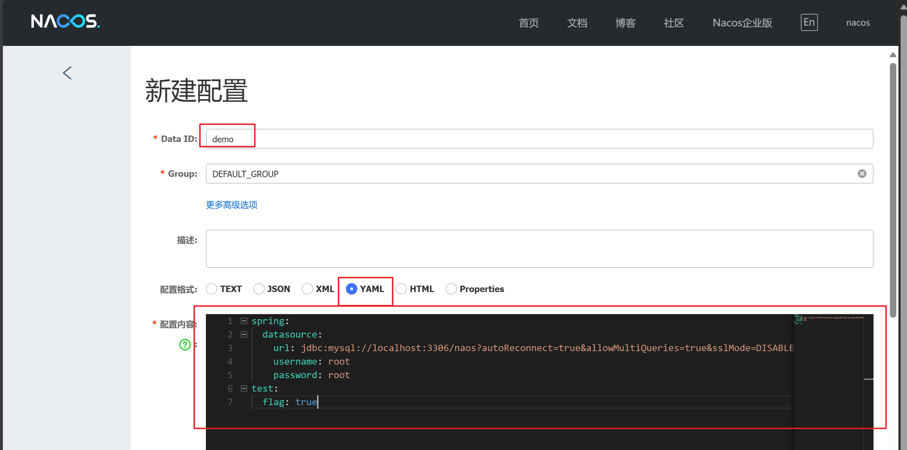

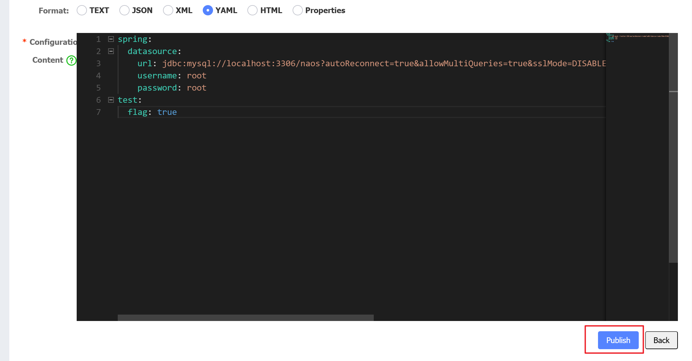

finally you can see as follow

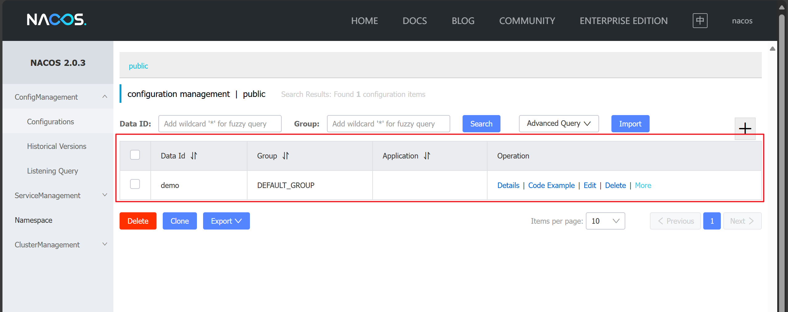

# Step5-run SpringBoot 

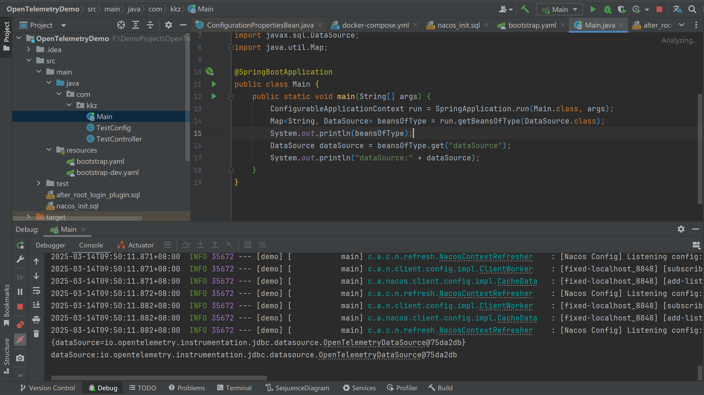

# Step6-change configuration in nacos

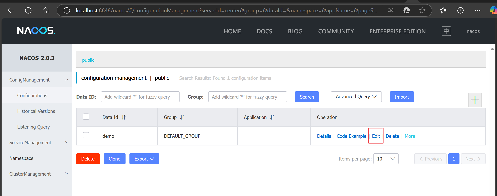

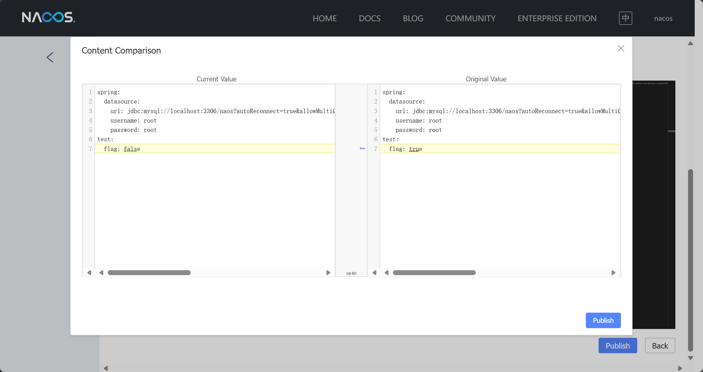

# Step7

**then you can see error in springboot project**

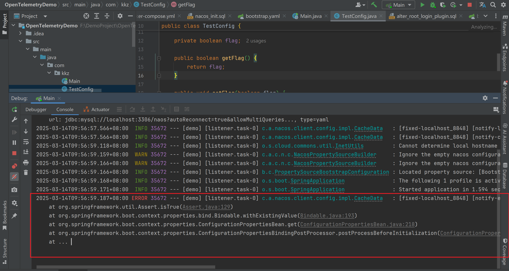

# Step8
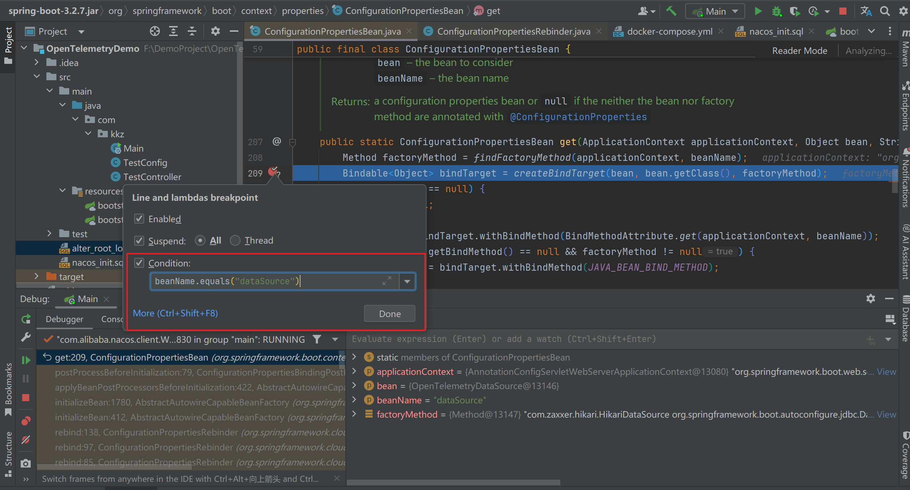

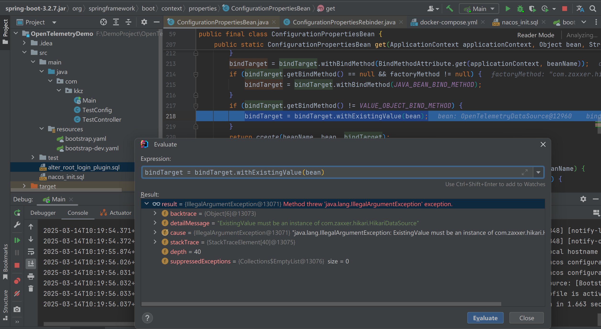